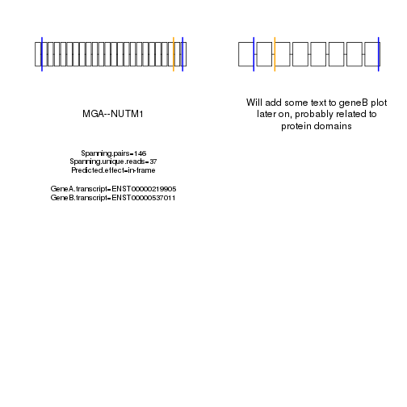

Load libraries.


```r
library(dplyr)
library(GenomicRanges)
```

Placeholder - Evan to set this dynamically in the future based on where the person is putting FusionVis.

This is so we can read in all the annotation Rdata files.


```r
installation_dir_FusionVis <- "/nethome/hmgeiger/FusionViz"
```

This script will accept as arguments the full path to a fusion detection program output, and arguments for genome (GRCh37/GRCh38) and program (STAR-Fusion/FusionCatcher).

Also an output directory.

For this documentation, I will hard code these values instead of reading in from command line.


```r
#Read in test file from subdirectory under FusionVis directory.
#This is also where we will put the output.

fusion_file <- paste0(installation_dir_FusionVis,"/visualize_incl_GenomicRanges_test/FusionCatcher_output_test.txt")
fusion_program <- "FusionCatcher"
genome <- "GRCh37"
output_dir <- paste0(installation_dir_FusionVis,"/visualize_incl_GenomicRanges_test")
```

Load different annotation Rdata files depending on genome version specified.

Still need to make the ones for GRCh38.


```r
if(genome == "GRCh37")
{
load(paste0(installation_dir_FusionVis,"/annotation/biomart_db_GRCh37_exons_as_data_frame.Rdata"))
load(paste0(installation_dir_FusionVis,"/annotation/biomart_db_GRCh37_exons_as_GRanges.Rdata"))
load(paste0(installation_dir_FusionVis,"/annotation/biomart_db_GRCh37_introns_as_GRanges.Rdata"))
load(paste0(installation_dir_FusionVis,"/annotation/biomart_db_GRCh37_total_exons_per_transcript.Rdata"))
load(paste0(installation_dir_FusionVis,"/annotation/biomart_db_GRCh37_rank_per_transcript.Rdata"))
load(paste0(installation_dir_FusionVis,"/annotation/biomart_db_GRCh37_utrs_for_plotting.Rdata"))
}

#Will eventually have similar files to read in for GRCh38.
#For now, exit with an error if genome is GRCh38.

if(genome == "GRCh38")
{
print("Program does not currently have GRCh38 annotation available. Exiting")
quit()
}
```

Let's explore these annotation files a bit.

Some are data frames, some are GRanges which are useful for quickly intersecting coordinates.

```r
#Let's show the GRanges objects first.
#We have one for all annotated exons and one for all annotated introns.

exons_as_GRanges
```

```
## GRanges object with 1306656 ranges and 3 metadata columns:
##                     seqnames         ranges strand |   exon_id
##                        <Rle>      <IRanges>  <Rle> | <integer>
##   ENST00000456328          1 [11869, 12227]      + |         1
##   ENST00000456328          1 [12613, 12721]      + |         8
##   ENST00000456328          1 [13221, 14409]      + |        12
##   ENST00000515242          1 [11872, 12227]      + |         2
##   ENST00000515242          1 [12613, 12721]      + |         9
##               ...        ...            ...    ... .       ...
##   ENST00000476361 GL000243.1 [ 8050,  8132]      + |    738005
##   ENST00000580872 GL000247.1 [10271, 10353]      - |    738006
##   ENST00000459271 GL000247.1 [11746, 11828]      - |    738007
##   ENST00000458778 GL000247.1 [11986, 12067]      - |    738008
##   ENST00000606635 GL000247.1 [12803, 12884]      - |    738009
##                         exon_name exon_rank
##                       <character> <integer>
##   ENST00000456328 ENSE00002234944         1
##   ENST00000456328 ENSE00003582793         2
##   ENST00000456328 ENSE00002312635         3
##   ENST00000515242 ENSE00002234632         1
##   ENST00000515242 ENSE00003608237         2
##               ...             ...       ...
##   ENST00000476361 ENSE00001877993         1
##   ENST00000580872 ENSE00002691431         1
##   ENST00000459271 ENSE00001814171         1
##   ENST00000458778 ENSE00001807025         1
##   ENST00000606635 ENSE00003700638         1
##   -------
##   seqinfo: 297 sequences (1 circular) from an unspecified genome
```

```r
introns_as_GRanges
```

```
## GRanges object with 1091486 ranges and 0 metadata columns:
##                     seqnames         ranges strand
##                        <Rle>      <IRanges>  <Rle>
##   ENST00000456328          1 [12228, 12612]      +
##   ENST00000456328          1 [12722, 13220]      +
##   ENST00000515242          1 [12228, 12612]      +
##   ENST00000515242          1 [12722, 13224]      +
##   ENST00000518655          1 [12228, 12594]      +
##               ...        ...            ...    ...
##   ENST00000368515 GL000228.1 [31738, 31995]      -
##   ENST00000602027 GL000237.1 [ 1004,  2472]      -
##   ENST00000507732 GL000242.1 [14377, 17444]      +
##   ENST00000507732 GL000242.1 [17533, 23600]      +
##   ENST00000507732 GL000242.1 [26367, 34083]      +
##   -------
##   seqinfo: 297 sequences (1 circular) from an unspecified genome
```

```r
#Next, show the exons data frame.

head(exons_as_data_frame)
```

```
##            TXNAME  CDSSTART    CDSEND EXONCHROM EXONSTRAND EXONSTART
## 1 ENST00000000233 127228553 127228619         7          + 127228399
## 2 ENST00000000233 127229137 127229217         7          + 127229137
## 3 ENST00000000233 127229539 127229648         7          + 127229539
## 4 ENST00000000233 127230120 127230191         7          + 127230120
## 5 ENST00000000233 127231017 127231142         7          + 127231017
## 6 ENST00000000233 127231267 127231353         7          + 127231267
##     EXONEND EXONRANK CDSLENGTH EXONLENGTH
## 1 127228619        1        67        221
## 2 127229217        2        81         81
## 3 127229648        3       110        110
## 4 127230191        4        72         72
## 5 127231142        5       126        126
## 6 127231759        6        87        493
```

```r
head(exons_as_data_frame[which(exons_as_data_frame$EXONSTRAND == "-"),])
```

```
##             TXNAME CDSSTART  CDSEND EXONCHROM EXONSTRAND EXONSTART EXONEND
## 7  ENST00000000412  9095012 9095138        12          -   9095012 9095138
## 8  ENST00000000412  9098825 9099000        12          -   9098825 9099001
## 9  ENST00000000412  9098014 9098180        12          -   9098014 9098180
## 10 ENST00000000412       NA      NA        12          -   9102084 9102551
## 11 ENST00000000412  9096397 9096506        12          -   9096397 9096506
## 12 ENST00000000412  9096001 9096131        12          -   9096001 9096131
##    EXONRANK CDSLENGTH EXONLENGTH
## 7         6       127        127
## 8         2       176        177
## 9         3       167        167
## 10        1        NA        468
## 11        4       110        110
## 12        5       131        131
```

```r
dim(exons_as_data_frame)
```

```
## [1] 1306656      10
```

```r
length(unique(exons_as_data_frame$TXNAME))
```

```
## [1] 215170
```

```r
#What about the transcript info file?

head(transcript_info)
```

```
##                 external_gene_name ensembl_transcript_id
## ENST00000589042                TTN       ENST00000589042
## ENST00000591111                TTN       ENST00000591111
## ENST00000342992                TTN       ENST00000342992
## ENST00000342175                TTN       ENST00000342175
## ENST00000359218                TTN       ENST00000359218
## ENST00000460472                TTN       ENST00000460472
##                 transcript_biotype cds_length transcript_length coding
## ENST00000589042     protein_coding     107976            109224      1
## ENST00000591111     protein_coding     103053            104301      1
## ENST00000342992     protein_coding     100272            101518      1
## ENST00000342175     protein_coding      81357             82605      1
## ENST00000359218     protein_coding      81156             82404      1
## ENST00000460472     protein_coding      80781             82029      1
```

```r
dim(transcript_info)
```

```
## [1] 215170      6
```

```r
#Related - a simple two column file giving the total number of exons per transcript 
#(should probably combine this with transcript_info).

head(total_exons_per_transcript)
```

```
##            TXNAME TotalExonNum
## 1 ENST00000000233            6
## 2 ENST00000000412            7
## 3 ENST00000000442            7
## 4 ENST00000001008           10
## 5 ENST00000001146            6
## 6 ENST00000002125           10
```

```r
dim(total_exons_per_transcript)
```

```
## [1] 215170      2
```

```r
#Finally, we have a file which for all transcripts that have UTR(s), shows in which exons those UTRs fall, and how far into the exon they are if the boundaries are not right at the start or end of the exon.

head(utrs_data_frame_for_plotting)
```

```
##   Breakpoint      Transcript ExonicOrNot ExonInOrBefore TotalExonNum
## 1  127228552 ENST00000000233         yes              1            6
## 2  127231354 ENST00000000233         yes              6            6
## 3    9099001 ENST00000000412         yes              2            7
## 4    9094413 ENST00000000412         yes              7            7
## 5   64074651 ENST00000000442         yes              2            7
## 6   64083439 ENST00000000442         yes              7            7
##   StartMiddleEnd LengthIntoExon PercentIntoExon
## 1         Middle            154       69.683258
## 2         Middle             88       17.849899
## 3          Start             NA              NA
## 4         Middle            124        7.868020
## 5         Middle             12        3.560831
## 6         Middle            261       25.290698
```

```r
dim(utrs_data_frame_for_plotting)
```

```
## [1] 167321      8
```

```r
length(unique(utrs_data_frame_for_plotting$Transcript))
```

```
## [1] 99869
```

Now, let's read in the fusion program output.

Both FusionCatcher and STAR-Fusion will be read in the same way.


```r
fusion_file <- read.table(fusion_file,header=TRUE,sep="\t",comment.char="",quote="",check.names=FALSE,stringsAsFactors=FALSE)
```

If FusionCatcher, breakpoints are called "Fusion_point_for_gene_1(5end_fusion_partner)" and "Fusion_point_for_gene_2(3end_fusion_partner)".

If STAR-Fusion, breakpoints are called "LeftBreakpoint" and "RightBreakpoint".

Both are in format chr:breakpoint:strand.


Fusioncatcher geneA and geneB are called "Gene_1_symbol(5end_fusion_partner)" and "Gene_2_symbol(3end_fusion_partner)".

STAR-Fusion field "#FusionName" = GeneA--GeneB.

Fusioncatcher is unique in having another field that is per gene combination called "description", that tells whether the fusion is normally found in healthy or cancer samples, etc.


Then, both programs have a few fields that are specific to each breakpoint combination, rather than each gene combination.

FusionCatcher: "Spanning_pairs","Spanning_unique_reads","Predicted_effect"

STAR-Fusion: "JunctionReadCount","SpanningFragCount","SpliceType"


```r
if(fusion_program == "FusionCatcher")
{
breakpoints_geneA <- fusion_file[,"Fusion_point_for_gene_1(5end_fusion_partner)"]
breakpoints_geneB <- fusion_file[,"Fusion_point_for_gene_2(3end_fusion_partner)"]
geneA_plus_geneB_names <- paste0(fusion_file[,"Gene_1_symbol(5end_fusion_partner)"],"--",fusion_file[,"Gene_2_symbol(3end_fusion_partner)"])
in_frame_vs_not <- rep("Not in-frame",times=nrow(fusion_file))
in_frame_vs_not[which(fusion_file[,"Predicted_effect"] == "in-frame")] <- "in-frame"
descriptions_per_fusion <- fusion_file[,"Fusion_description"]
#Here put information we do not technically need to make the plot, but that may be useful to know (like number of supporting reads).
#This contains breakpoint-specific information.
other_info_to_possibly_display <- paste0("Spanning.pairs=",fusion_file[,"Spanning_pairs"],";Spanning.unique.reads=",fusion_file[,"Spanning_unique_reads"],";Predicted.effect=",fusion_file[,"Predicted_effect"])
}

if(fusion_program == "STAR-Fusion")
{
breakpoints_geneA <- fusion_file[,"LeftBreakpoint"]
breakpoints_geneB <- fusion_file[,"RightBreakpoint"]
geneA_plus_geneB_names <- fusion_file[,"#FusionName"]
#STAR-Fusion does not output anything equivalent to in-frame from FusionCatcher. So, will not be able to color by in-frame vs. not for STAR-Fusion, so just make NA.
in_frame_vs_not <- rep(NA,times=nrow(fusion_file))
#STAR-Fusion also does not output any description, so just leave a blank for description for those outputs.
descriptions_per_fusion <- rep("No description",times=nrow(fusion_file))
#Again, we put information that we do not technically need to make the plot, but that may be useful to know, in other_info_to_possibly_display.
other_info_to_possibly_display <- paste0("JunctionReadCount=",fusion_file[,"JunctionReadCount"],";SpanningFragCount=",fusion_file[,"SpanningFragCount"],";SpliceType=",fusion_file[,"SpliceType"])
}
```

Now, we put all of these values we just obtained into a data frame, and display the first few rows.


```r
fusion_file_main_info <- data.frame(GeneA.GeneB = geneA_plus_geneB_names,FusionDescription = descriptions_per_fusion,GeneA.Breakpoint = breakpoints_geneA,GeneB.Breakpoint = breakpoints_geneB,In.frame.status = in_frame_vs_not,Other.breakpoint.specific.info = other_info_to_possibly_display,stringsAsFactors=FALSE)

head(fusion_file_main_info)
```

```
##     GeneA.GeneB
## 1    MGA--NUTM1
## 2    MGA--NUTM1
## 3 FAM175A--HELQ
## 4 FAM175A--HELQ
## 5 FAM175A--HELQ
## 6 FAM175A--HELQ
##                                                        FusionDescription
## 1                                                                       
## 2                                                                       
## 3 adjacent,known,healthy,cacg,bodymap2,hpa,banned,1K<gap<10K,readthrough
## 4 adjacent,known,healthy,cacg,bodymap2,hpa,banned,1K<gap<10K,readthrough
## 5 adjacent,known,healthy,cacg,bodymap2,hpa,banned,1K<gap<10K,readthrough
## 6 adjacent,known,healthy,cacg,bodymap2,hpa,banned,1K<gap<10K,readthrough
##   GeneA.Breakpoint GeneB.Breakpoint In.frame.status
## 1    15:42054560:+    15:34640170:+        in-frame
## 2    15:42054048:+    15:34640170:+        in-frame
## 3     4:84384647:-     4:84375098:-    Not in-frame
## 4     4:84397796:-     4:84375098:-    Not in-frame
## 5     4:84403307:-     4:84375098:-        in-frame
## 6     4:84391356:-     4:84375098:-    Not in-frame
##                                             Other.breakpoint.specific.info
## 1    Spanning.pairs=146;Spanning.unique.reads=37;Predicted.effect=in-frame
## 2     Spanning.pairs=146;Spanning.unique.reads=4;Predicted.effect=in-frame
## 3 Spanning.pairs=27;Spanning.unique.reads=16;Predicted.effect=out-of-frame
## 4  Spanning.pairs=27;Spanning.unique.reads=2;Predicted.effect=out-of-frame
## 5      Spanning.pairs=27;Spanning.unique.reads=1;Predicted.effect=in-frame
## 6  Spanning.pairs=27;Spanning.unique.reads=1;Predicted.effect=out-of-frame
```

Get chromosome, coordinate, and strand from breakpoints_geneA and breakpoints_geneB using the strsplit function to separate the fields separated by ":".


```r
breakpoints_geneA_data_frame <- data.frame(chr = sapply(strsplit(breakpoints_geneA,":"),"[[",1),coordinate = sapply(strsplit(breakpoints_geneA,":"),"[[",2),strand = sapply(strsplit(breakpoints_geneA,":"),"[[",3),Breakpoint.string = breakpoints_geneA,stringsAsFactors=FALSE)
breakpoints_geneA_data_frame$coordinate <- as.numeric(as.vector(breakpoints_geneA_data_frame$coordinate))

breakpoints_geneB_data_frame <- data.frame(chr = sapply(strsplit(breakpoints_geneB,":"),"[[",1),coordinate = sapply(strsplit(breakpoints_geneB,":"),"[[",2),strand = sapply(strsplit(breakpoints_geneB,":"),"[[",3),Breakpoint.string = breakpoints_geneB,stringsAsFactors=FALSE)
breakpoints_geneB_data_frame$coordinate <- as.numeric(as.vector(breakpoints_geneB_data_frame$coordinate))

head(breakpoints_geneA_data_frame)
```

```
##   chr coordinate strand Breakpoint.string
## 1  15   42054560      +     15:42054560:+
## 2  15   42054048      +     15:42054048:+
## 3   4   84384647      -      4:84384647:-
## 4   4   84397796      -      4:84397796:-
## 5   4   84403307      -      4:84403307:-
## 6   4   84391356      -      4:84391356:-
```

```r
head(breakpoints_geneB_data_frame)
```

```
##   chr coordinate strand Breakpoint.string
## 1  15   34640170      +     15:34640170:+
## 2  15   34640170      +     15:34640170:+
## 3   4   84375098      -      4:84375098:-
## 4   4   84375098      -      4:84375098:-
## 5   4   84375098      -      4:84375098:-
## 6   4   84375098      -      4:84375098:-
```

In this version of the script, I am now using Ensembl annotation, which does not have "chr" prefix on chromosomes.

Check the breakpoints and see if they have "chr" prefix. If so, auto remove it to make compatible with annotation.


```r
if(length(grep('chr',breakpoints_geneA_data_frame$chr[1])) == 1)
{
breakpoints_geneA_data_frame$chr <- sapply(strsplit(breakpoints_geneA_data_frame$chr,"chr"),"[[",2)
breakpoints_geneB_data_frame$chr <- sapply(strsplit(breakpoints_geneB_data_frame$chr,"chr"),"[[",2)
}
```

Now, make a GRanges object out of each of the two breakpoint data frames.


```r
breakpoints_geneA_GRanges <- GRanges(seqnames = breakpoints_geneA_data_frame$chr,
ranges = IRanges(breakpoints_geneA_data_frame$coordinate,breakpoints_geneA_data_frame$coordinate),
name = breakpoints_geneA_data_frame$Breakpoint.string,
strand = breakpoints_geneA_data_frame$strand)

breakpoints_geneB_GRanges <- GRanges(seqnames = breakpoints_geneB_data_frame$chr,
ranges = IRanges(breakpoints_geneB_data_frame$coordinate,breakpoints_geneB_data_frame$coordinate),
name = breakpoints_geneB_data_frame$Breakpoint.string,
strand = breakpoints_geneB_data_frame$strand)

breakpoints_geneA_GRanges
```

```
## GRanges object with 109 ranges and 1 metadata column:
##         seqnames               ranges strand |          name
##            <Rle>            <IRanges>  <Rle> |   <character>
##     [1]       15 [42054560, 42054560]      + | 15:42054560:+
##     [2]       15 [42054048, 42054048]      + | 15:42054048:+
##     [3]        4 [84384647, 84384647]      - |  4:84384647:-
##     [4]        4 [84397796, 84397796]      - |  4:84397796:-
##     [5]        4 [84403307, 84403307]      - |  4:84403307:-
##     ...      ...                  ...    ... .           ...
##   [105]       11 [61135470, 61135470]      + | 11:61135470:+
##   [106]       17 [ 7464884,  7464884]      + |  17:7464884:+
##   [107]       17 [ 7464884,  7464884]      + |  17:7464884:+
##   [108]       19 [57011616, 57011616]      + | 19:57011616:+
##   [109]        3 [44552045, 44552045]      - |  3:44552045:-
##   -------
##   seqinfo: 23 sequences from an unspecified genome; no seqlengths
```

```r
breakpoints_geneB_GRanges
```

```
## GRanges object with 109 ranges and 1 metadata column:
##         seqnames               ranges strand |          name
##            <Rle>            <IRanges>  <Rle> |   <character>
##     [1]       15 [34640170, 34640170]      + | 15:34640170:+
##     [2]       15 [34640170, 34640170]      + | 15:34640170:+
##     [3]        4 [84375098, 84375098]      - |  4:84375098:-
##     [4]        4 [84375098, 84375098]      - |  4:84375098:-
##     [5]        4 [84375098, 84375098]      - |  4:84375098:-
##     ...      ...                  ...    ... .           ...
##   [105]       11 [61160236, 61160236]      + | 11:61160236:+
##   [106]       17 [ 7487236,  7487236]      + |  17:7487236:+
##   [107]       17 [ 7487236,  7487236]      + |  17:7487236:+
##   [108]       19 [57022886, 57022886]      + | 19:57022886:+
##   [109]        3 [44499856, 44499856]      - |  3:44499856:-
##   -------
##   seqinfo: 21 sequences from an unspecified genome; no seqlengths
```

Overlap these with exon GRanges.

Then, output the relevant info, including the transcript name plus which exon it matched up to.


```r
overlaps_transcript_exon_coords_and_breakpoints_geneA <- mergeByOverlaps(exons_as_GRanges,breakpoints_geneA_GRanges,maxgap=-1L)

overlaps_transcript_exon_coords_and_breakpoints_geneA
```

```
## DataFrame with 414 rows and 6 columns
##          exons_as_GRanges   exon_id       exon_name exon_rank
##                 <GRanges> <integer>     <character> <integer>
## 1   1:27094281-27094490:+      5567 ENSE00001349752        11
## 2   1:27094281-27094490:+      5567 ENSE00001349752        11
## 3   1:27094281-27094490:+      5567 ENSE00001349752        10
## 4   1:27094281-27094492:+      5568 ENSE00001698973         2
## 5   1:53072356-53072617:+     10661 ENSE00000835736         2
## ...                   ...       ...             ...       ...
## 410 X:63564925-63565057:-    665840 ENSE00003624461         7
## 411 X:63564925-63565038:-    665838 ENSE00001949212         1
## 412 X:63564925-63565057:-    665839 ENSE00003463397         3
## 413 Y:15815447-15816315:+    672004 ENSE00001016870         1
## 414 Y:15815447-15816315:+    672004 ENSE00001016870         1
##     breakpoints_geneA_GRanges         name
##                     <GRanges>  <character>
## 1                1:27094490:+ 1:27094490:+
## 2                1:27094490:+ 1:27094490:+
## 3                1:27094490:+ 1:27094490:+
## 4                1:27094490:+ 1:27094490:+
## 5                1:53072617:+ 1:53072617:+
## ...                       ...          ...
## 410              X:63564925:- X:63564925:-
## 411              X:63564925:- X:63564925:-
## 412              X:63564925:- X:63564925:-
## 413              Y:15816315:+ Y:15816315:+
## 414              Y:15816315:+ Y:15816315:+
```

```r
overlaps_transcript_exon_coords_and_breakpoints_geneA$exons_as_GRanges
```

```
## GRanges object with 414 ranges and 3 metadata columns:
##                   seqnames               ranges strand |   exon_id
##                      <Rle>            <IRanges>  <Rle> | <integer>
##   ENST00000324856        1 [27094281, 27094490]      + |      5567
##   ENST00000457599        1 [27094281, 27094490]      + |      5567
##   ENST00000374152        1 [27094281, 27094490]      + |      5567
##   ENST00000430291        1 [27094281, 27094492]      + |      5568
##   ENST00000361314        1 [53072356, 53072617]      + |     10661
##               ...      ...                  ...    ... .       ...
##   ENST00000374852        X [63564925, 63565057]      - |    665840
##   ENST00000478487        X [63564925, 63565038]      - |    665838
##   ENST00000461403        X [63564925, 63565057]      - |    665839
##   ENST00000284856        Y [15815447, 15816315]      + |    672004
##   ENST00000284856        Y [15815447, 15816315]      + |    672004
##                         exon_name exon_rank
##                       <character> <integer>
##   ENST00000324856 ENSE00001349752        11
##   ENST00000457599 ENSE00001349752        11
##   ENST00000374152 ENSE00001349752        10
##   ENST00000430291 ENSE00001698973         2
##   ENST00000361314 ENSE00000835736         2
##               ...             ...       ...
##   ENST00000374852 ENSE00003624461         7
##   ENST00000478487 ENSE00001949212         1
##   ENST00000461403 ENSE00003463397         3
##   ENST00000284856 ENSE00001016870         1
##   ENST00000284856 ENSE00001016870         1
##   -------
##   seqinfo: 297 sequences (1 circular) from an unspecified genome
```

```r
overlaps_transcript_exon_coords_and_breakpoints_geneA$breakpoints_geneA_GRanges
```

```
## GRanges object with 414 ranges and 1 metadata column:
##         seqnames               ranges strand |         name
##            <Rle>            <IRanges>  <Rle> |  <character>
##     [1]        1 [27094490, 27094490]      + | 1:27094490:+
##     [2]        1 [27094490, 27094490]      + | 1:27094490:+
##     [3]        1 [27094490, 27094490]      + | 1:27094490:+
##     [4]        1 [27094490, 27094490]      + | 1:27094490:+
##     [5]        1 [53072617, 53072617]      + | 1:53072617:+
##     ...      ...                  ...    ... .          ...
##   [410]        X [63564925, 63564925]      - | X:63564925:-
##   [411]        X [63564925, 63564925]      - | X:63564925:-
##   [412]        X [63564925, 63564925]      - | X:63564925:-
##   [413]        Y [15816315, 15816315]      + | Y:15816315:+
##   [414]        Y [15816315, 15816315]      + | Y:15816315:+
##   -------
##   seqinfo: 23 sequences from an unspecified genome; no seqlengths
```

```r
#Get two data frames for the exons_as_GRanges and breakpoints_geneA_GRanges part of the overlap object.

transcript_exon_coords_overlapping_breakpoints_geneA <- BiocGenerics::as.data.frame(overlaps_transcript_exon_coords_and_breakpoints_geneA[,"exons_as_GRanges"],row.names=NULL)
breakpoint_geneA_coords_overlapping_transcript_exons <- BiocGenerics::as.data.frame(overlaps_transcript_exon_coords_and_breakpoints_geneA[,"breakpoints_geneA_GRanges"],row.names=NULL)

exon_num_per_transcript_per_breakpoint_geneA <- data.frame(Breakpoint.name = overlaps_transcript_exon_coords_and_breakpoints_geneA[,"name"],
TXNAME = names(overlaps_transcript_exon_coords_and_breakpoints_geneA$exons_as_GRanges), #We get the "ENST" names using the names function from GRanges now.
EXONRANK = as.numeric(as.vector(transcript_exon_coords_overlapping_breakpoints_geneA$exon_rank)),
EXONSTART = as.numeric(as.vector(transcript_exon_coords_overlapping_breakpoints_geneA$start)),
EXONEND = as.numeric(as.vector(transcript_exon_coords_overlapping_breakpoints_geneA$end)),
Breakpoint.coord = as.numeric(as.vector(breakpoint_geneA_coords_overlapping_transcript_exons$start)), #Get the breakpoint info as a numeric in addition to having the string.
stringsAsFactors=FALSE)

#We will see that in this initial overlap, the same breakpoint can match multiple transcripts.
head(exon_num_per_transcript_per_breakpoint_geneA)
```

```
##   Breakpoint.name          TXNAME EXONRANK EXONSTART  EXONEND
## 1    1:27094490:+ ENST00000324856       11  27094281 27094490
## 2    1:27094490:+ ENST00000457599       11  27094281 27094490
## 3    1:27094490:+ ENST00000374152       10  27094281 27094490
## 4    1:27094490:+ ENST00000430291        2  27094281 27094492
## 5    1:53072617:+ ENST00000361314        2  53072356 53072617
## 6    1:53072617:+ ENST00000459779        2  53072356 53073080
##   Breakpoint.coord
## 1         27094490
## 2         27094490
## 3         27094490
## 4         27094490
## 5         53072617
## 6         53072617
```

Similar code for geneB. Not going to show since this documentation is already quite long. :)


Let's also intersect with intron annotation.

Some fusion programs (like FusionCatcher) include fusions where the breakpoints are intronic.


```r
overlaps_transcript_intron_coords_and_breakpoints_geneA <- mergeByOverlaps(introns_as_GRanges,breakpoints_geneA_GRanges,maxgap=-1L)
transcript_intron_coords_overlapping_breakpoints_geneA <- BiocGenerics::as.data.frame(overlaps_transcript_intron_coords_and_breakpoints_geneA[,"introns_as_GRanges"],row.names=NULL)
breakpoint_geneA_coords_overlapping_transcript_introns <- BiocGenerics::as.data.frame(overlaps_transcript_intron_coords_and_breakpoints_geneA[,"breakpoints_geneA_GRanges"],row.names=NULL)

intron_per_transcript_per_breakpoint_geneA <- data.frame(Breakpoint.name = overlaps_transcript_intron_coords_and_breakpoints_geneA[,"name"],
 TXNAME = names(overlaps_transcript_intron_coords_and_breakpoints_geneA$introns_as_GRanges),
 INTRONSTART = as.numeric(as.vector(transcript_intron_coords_overlapping_breakpoints_geneA$start)),
 INTRONEND = as.numeric(as.vector(transcript_intron_coords_overlapping_breakpoints_geneA$end)),
 Breakpoint.coord = as.numeric(as.vector(breakpoint_geneA_coords_overlapping_transcript_introns$start)),
 stringsAsFactors=FALSE)
```

Repeat for gene B (not shown).


Now, choose the best transcript to represent each breakpoint.

First, we need to separate breakpoints that can be represented within exons, from those that are only in introns, from those that do not overlap either (and thus are "incompatible annotation").

Some breakpoints may overlap both exons and introns (of different transcripts), in which case we would rather use the exon to represent the breakpoint.


```r
#How many unique geneA/geneB breakpoints are there?
dim(fusion_file_main_info)
```

```
## [1] 109   6
```

```r
length(unique(fusion_file_main_info$GeneA.Breakpoint))
```

```
## [1] 97
```

```r
length(unique(fusion_file_main_info$GeneB.Breakpoint))
```

```
## [1] 88
```

```r
#How many geneA and geneB breakpoints overlap exons?
geneA_breakpoints_overlapping_exons <- unique(exon_num_per_transcript_per_breakpoint_geneA$Breakpoint.name)
geneB_breakpoints_overlapping_exons <- unique(exon_num_per_transcript_per_breakpoint_geneB$Breakpoint.name)

length(geneA_breakpoints_overlapping_exons)
```

```
## [1] 92
```

```r
length(geneB_breakpoints_overlapping_exons)
```

```
## [1] 82
```

```r
#Most breakpoints overlap exons, but a few do not.
#How many of these overlap introns, vs. not being found in the annotation at all?

geneA_breakpoints_overlapping_introns_only <- setdiff(unique(intron_per_transcript_per_breakpoint_geneA$Breakpoint.name),geneA_breakpoints_overlapping_exons)
geneB_breakpoints_overlapping_introns_only <- setdiff(unique(intron_per_transcript_per_breakpoint_geneB$Breakpoint.name),geneB_breakpoints_overlapping_exons)

length(geneA_breakpoints_overlapping_introns_only)
```

```
## [1] 4
```

```r
length(geneB_breakpoints_overlapping_introns_only)
```

```
## [1] 6
```

```r
#Looks like there is one geneA breakpoint that does not overlap any annotated exons or introns.
#Let's get the row number(s) where one or both genes has a breakpoint that does not overlap any annotated exons or introns.

geneA_breakpoints_incompatible_annotation <- setdiff(unique(breakpoints_geneA),c(geneA_breakpoints_overlapping_exons,geneA_breakpoints_overlapping_introns_only))
geneB_breakpoints_incompatible_annotation <- setdiff(unique(breakpoints_geneB),c(geneB_breakpoints_overlapping_exons,geneB_breakpoints_overlapping_introns_only))

incompatible_annotation_rows <- c()
if(length(geneA_breakpoints_incompatible_annotation) > 0){
	incompatible_annotation_rows <- c(incompatible_annotation_rows,grep(paste0(geneA_breakpoints_incompatible_annotation,collapse="|"),breakpoints_geneA))
}

if(length(geneB_breakpoints_incompatible_annotation) > 0){
	incompatible_annotation_rows <- c(incompatible_annotation_rows,grep(paste0(geneB_breakpoints_incompatible_annotation,collapse="|"),breakpoints_geneB))
}

#Unique in case some rows have unannotated breakpoints for both geneA and geneB.

incompatible_annotation_rows <- unique(incompatible_annotation_rows)

#Which row(s) are we skipping? Let's look at them in more detail.

fusion_file_main_info[incompatible_annotation_rows,]
```

```
##      GeneA.GeneB   FusionDescription GeneA.Breakpoint GeneB.Breakpoint
## 61 KDELC2--EXPH5 adjacent,1K<gap<10K   11:108342816:-   11:108464231:-
##    In.frame.status
## 61    Not in-frame
##                                                         Other.breakpoint.specific.info
## 61 Spanning.pairs=4;Spanning.unique.reads=3;Predicted.effect=intergenic/CDS(truncated)
```

Now, we have all possible exons across all annotated transcripts matching up to each breakpoint.

We need to choose the best isoform for each breakpoint.

Match up the exon per breakpoint table to the "transcript info" table.

Then, prioritize coding over noncoding, then longer CDS, then longer transcript.


```r
#Showing for geneA only.

exon_num_per_transcript_per_breakpoint_geneA <- merge(exon_num_per_transcript_per_breakpoint_geneA,transcript_info,
	by.x="TXNAME",by.y = "ensembl_transcript_id")

head(exon_num_per_transcript_per_breakpoint_geneA)
```

```
##            TXNAME Breakpoint.name EXONRANK EXONSTART  EXONEND
## 1 ENST00000006777    7:75513166:+        3  75513016 75513166
## 2 ENST00000216187   22:36886235:-        9  36884289 36886314
## 3 ENST00000219905   15:42054048:+       21  42053937 42054048
## 4 ENST00000219905   15:42054560:+       22  42054327 42054560
## 5 ENST00000223122     7:7278553:+        2   7277886  7278553
## 6 ENST00000223122     7:7283381:+        3   7283155  7288282
##   Breakpoint.coord external_gene_name transcript_biotype cds_length
## 1         75513166             RHBDD2     protein_coding       1095
## 2         36886235            FOXRED2     protein_coding       2055
## 3         42054048                MGA     protein_coding       9198
## 4         42054560                MGA     protein_coding       9198
## 5          7278553            C1GALT1     protein_coding       1092
## 6          7283381            C1GALT1     protein_coding       1092
##   transcript_length coding
## 1              1802      1
## 2              3933      1
## 3             12042      1
## 4             12042      1
## 5              6078      1
## 6              6078      1
```

```r
#Remember that "coding" is 1 for protein coding, 0 otherwise.
#So can use reverse numerical sort to get coding first.

rank_transcripts_by_best_to_represent <- order(exon_num_per_transcript_per_breakpoint_geneA$coding,
exon_num_per_transcript_per_breakpoint_geneA$cds_length,
exon_num_per_transcript_per_breakpoint_geneA$transcript_length,decreasing=TRUE)

exon_num_per_transcript_per_breakpoint_geneA <- exon_num_per_transcript_per_breakpoint_geneA[rank_transcripts_by_best_to_represent,]

head(exon_num_per_transcript_per_breakpoint_geneA)
```

```
##              TXNAME Breakpoint.name EXONRANK EXONSTART  EXONEND
## 3   ENST00000219905   15:42054048:+       21  42053937 42054048
## 4   ENST00000219905   15:42054560:+       22  42054327 42054560
## 366 ENST00000570161   15:42054048:+       20  42053937 42054048
## 367 ENST00000570161   15:42054560:+       21  42054327 42054560
## 114 ENST00000389936   15:42054048:+       22  42053937 42054048
## 115 ENST00000389936   15:42054560:+       23  42054327 42054560
##     Breakpoint.coord external_gene_name transcript_biotype cds_length
## 3           42054048                MGA     protein_coding       9198
## 4           42054560                MGA     protein_coding       9198
## 366         42054048                MGA     protein_coding       9198
## 367         42054560                MGA     protein_coding       9198
## 114         42054048                MGA     protein_coding       9081
## 115         42054560                MGA     protein_coding       9081
##     transcript_length coding
## 3               12042      1
## 4               12042      1
## 366             11859      1
## 367             11859      1
## 114             11921      1
## 115             11921      1
```

```r
#After this ordering, take the first occurence of each breakpoint.

exon_num_per_transcript_per_breakpoint_geneA <- exon_num_per_transcript_per_breakpoint_geneA[which(
duplicated(exon_num_per_transcript_per_breakpoint_geneA$Breakpoint.name) == FALSE),]
```

Similar for introns.

Except, first we remove from the intron table breakpoints that have matching exons.


```r
#Remove breakpoints matching exons.

intron_per_transcript_per_breakpoint_geneA <- merge(intron_per_transcript_per_breakpoint_geneA,
data.frame(Breakpoint.name = geneA_breakpoints_overlapping_introns_only),
by = "Breakpoint.name")

intron_per_transcript_per_breakpoint_geneA <- merge(intron_per_transcript_per_breakpoint_geneA,transcript_info,
	by.x="TXNAME",by.y = "ensembl_transcript_id")

rank_transcripts_by_best_to_represent <- order(intron_per_transcript_per_breakpoint_geneA$coding,
intron_per_transcript_per_breakpoint_geneA$cds_length,
intron_per_transcript_per_breakpoint_geneA$transcript_length,decreasing=TRUE)

intron_per_transcript_per_breakpoint_geneA <- intron_per_transcript_per_breakpoint_geneA[rank_transcripts_by_best_to_represent,]

intron_per_transcript_per_breakpoint_geneA <- intron_per_transcript_per_breakpoint_geneA[which(
duplicated(intron_per_transcript_per_breakpoint_geneA$Breakpoint.name) == FALSE),]
```

Repeat for gene B (not shown).


Now, we need to get the nearest exon for the intron annotation.


```r
#Match up the intron coordinates with the exons data frame.
introns_geneA_find_exon_before <- merge(intron_per_transcript_per_breakpoint_geneA,
exons_as_data_frame[,c("EXONSTRAND","EXONSTART","EXONEND","EXONRANK","TXNAME")],
by="TXNAME")

#If on positive strand, subtract one from the intron start. This will give EXONEND of the exon before.
#If on negative strand, add one to the intron end. This will give EXONSTART of the exon before.

indices_rows_where_intron_adjacent_to_exon <- which(introns_geneA_find_exon_before$EXONSTRAND == "+" & 
(introns_geneA_find_exon_before$INTRONSTART - 1) == introns_geneA_find_exon_before$EXONEND)

indices_rows_where_intron_adjacent_to_exon <- c(indices_rows_where_intron_adjacent_to_exon,which(introns_geneA_find_exon_before$EXONSTRAND == "-" & 
(introns_geneA_find_exon_before$INTRONEND + 1) == introns_geneA_find_exon_before$EXONSTART))

introns_geneA_find_exon_before <- introns_geneA_find_exon_before[indices_rows_where_intron_adjacent_to_exon,]

head(introns_geneA_find_exon_before)
```

```
##             TXNAME Breakpoint.name INTRONSTART INTRONEND Breakpoint.coord
## 9  ENST00000288111   14:24767820:-    24766088  24768162         24767820
## 15 ENST00000400256     18:325628:-      321808    331667           325628
## 24 ENST00000400256     18:470221:-      357523    480706           470221
## 39 ENST00000455511  12:110825106:-   110824275 110825543        110825106
##    external_gene_name transcript_biotype cds_length transcript_length
## 9               DHRS1     protein_coding        942              1480
## 15            COLEC12     protein_coding       2229              3121
## 24            COLEC12     protein_coding       2229              3121
## 39             ANAPC7     protein_coding       1800              3045
##    coding EXONSTRAND EXONSTART   EXONEND EXONRANK
## 9       1          -  24768163  24768336        2
## 15      1          -    331668    331777        8
## 24      1          -    480707    480757        2
## 39      1          - 110825544 110825697        5
```


Add additional info to exon table as well, mainly the strand information plus exon length for matching exons.


```r
exon_num_per_transcript_per_breakpoint_geneA <- merge(exon_num_per_transcript_per_breakpoint_geneA,
exons_as_data_frame[,c("TXNAME","EXONRANK","EXONSTRAND","EXONLENGTH")],
by=c("TXNAME","EXONRANK"))

exon_num_per_transcript_per_breakpoint_geneB <- merge(exon_num_per_transcript_per_breakpoint_geneB,
exons_as_data_frame[,c("TXNAME","EXONRANK","EXONSTRAND","EXONLENGTH")],
by=c("TXNAME","EXONRANK"))

head(exon_num_per_transcript_per_breakpoint_geneA)
```

```
##            TXNAME EXONRANK Breakpoint.name EXONSTART   EXONEND
## 1 ENST00000006777        3    7:75513166:+  75513016  75513166
## 2 ENST00000219905       21   15:42054048:+  42053937  42054048
## 3 ENST00000219905       22   15:42054560:+  42054327  42054560
## 4 ENST00000225964       50   17:48263190:-  48263139  48263381
## 5 ENST00000260952        5   2:190532671:+ 190532490 190532671
## 6 ENST00000262293        9   17:57275150:+  57275054  57275150
##   Breakpoint.coord external_gene_name transcript_biotype cds_length
## 1         75513166             RHBDD2     protein_coding       1095
## 2         42054048                MGA     protein_coding       9198
## 3         42054560                MGA     protein_coding       9198
## 4         48263190             COL1A1     protein_coding       4395
## 5        190532671             ASNSD1     protein_coding       1932
## 6         57275150              PRR11     protein_coding       1083
##   transcript_length coding EXONSTRAND EXONLENGTH
## 1              1802      1          +        151
## 2             12042      1          +        112
## 3             12042      1          +        234
## 4              6727      1          -        243
## 5              2450      1          +        182
## 6              2332      1          +         97
```

Switch exon start and end if on negative strand.


```r
geneA_new_exon_start_and_end <- data.frame(
EXONSTART = exon_num_per_transcript_per_breakpoint_geneA$EXONSTART,
EXONEND = exon_num_per_transcript_per_breakpoint_geneA$EXONEND)

geneA_new_exon_start_and_end$EXONSTART <- ifelse(exon_num_per_transcript_per_breakpoint_geneA$EXONSTRAND == "+",
exon_num_per_transcript_per_breakpoint_geneA$EXONSTART,
exon_num_per_transcript_per_breakpoint_geneA$EXONEND)

geneA_new_exon_start_and_end$EXONEND <- ifelse(exon_num_per_transcript_per_breakpoint_geneA$EXONSTRAND == "+",
exon_num_per_transcript_per_breakpoint_geneA$EXONEND,
exon_num_per_transcript_per_breakpoint_geneA$EXONSTART)
```


Now, determine start, middle, or end and percent into exon based on distance from start or end.


```r
geneA_matching_exon_start_middle_end <- rep("Middle",
times=nrow(exon_num_per_transcript_per_breakpoint_geneA))

geneA_matching_exon_start_middle_end[which(
exon_num_per_transcript_per_breakpoint_geneA$Breakpoint.coord == 
geneA_new_exon_start_and_end$EXONSTART)] <- "Start"

geneA_matching_exon_start_middle_end[which(
exon_num_per_transcript_per_breakpoint_geneA$Breakpoint.coord == 
geneA_new_exon_start_and_end$EXONEND)] <- "End"

geneA_length_into_exon <- abs(
exon_num_per_transcript_per_breakpoint_geneA$Breakpoint.coord - 
geneA_new_exon_start_and_end$EXONSTART) + 1

geneA_length_into_exon[which(geneA_matching_exon_start_middle_end != "Middle")] <- NA

geneA_percent_into_exon <- geneA_length_into_exon/
exon_num_per_transcript_per_breakpoint_geneA$EXONLENGTH
```


Now, we use the information about which exon each breakpoint matches up to plus whether the breakpoint falls at start/middle/end, to make a big data frame.


```r
#"Transcript other info" has info like the biotype of the transcript, which we may want to display later on.
exon_num_per_transcript_per_breakpoint_geneA <- data.frame(
Breakpoint = exon_num_per_transcript_per_breakpoint_geneA$Breakpoint.coord,
Transcript = exon_num_per_transcript_per_breakpoint_geneA$TXNAME,
ExonicOrNot = "yes",
ExonInOrBefore = exon_num_per_transcript_per_breakpoint_geneA$EXONRANK,
Breakpoint.name = exon_num_per_transcript_per_breakpoint_geneA$Breakpoint.name,
StartMiddleEnd = geneA_matching_exon_start_middle_end,LengthIntoExon = geneA_length_into_exon,PercentIntoExon = geneA_percent_into_exon,
Transcript.other.info = paste0("Transcript_gene_name=",exon_num_per_transcript_per_breakpoint_geneA$external_gene_name,";Transcript_biotype=",exon_num_per_transcript_per_breakpoint_geneA$transcript_biotype,";Transcript_CDS_length=",exon_num_per_transcript_per_breakpoint_geneA$cds_length,";Transcript_total_length=",exon_num_per_transcript_per_breakpoint_geneA$transcript_length),
stringsAsFactors=FALSE)

head(exon_num_per_transcript_per_breakpoint_geneA)
```

```
##   Breakpoint      Transcript ExonicOrNot ExonInOrBefore Breakpoint.name
## 1   75513166 ENST00000006777         yes              3    7:75513166:+
## 2   42054048 ENST00000219905         yes             21   15:42054048:+
## 3   42054560 ENST00000219905         yes             22   15:42054560:+
## 4   48263190 ENST00000225964         yes             50   17:48263190:-
## 5  190532671 ENST00000260952         yes              5   2:190532671:+
## 6   57275150 ENST00000262293         yes              9   17:57275150:+
##   StartMiddleEnd LengthIntoExon PercentIntoExon
## 1            End             NA              NA
## 2            End             NA              NA
## 3            End             NA              NA
## 4         Middle            192       0.7901235
## 5            End             NA              NA
## 6            End             NA              NA
##                                                                                                   Transcript.other.info
## 1 Transcript_gene_name=RHBDD2;Transcript_biotype=protein_coding;Transcript_CDS_length=1095;Transcript_total_length=1802
## 2   Transcript_gene_name=MGA;Transcript_biotype=protein_coding;Transcript_CDS_length=9198;Transcript_total_length=12042
## 3   Transcript_gene_name=MGA;Transcript_biotype=protein_coding;Transcript_CDS_length=9198;Transcript_total_length=12042
## 4 Transcript_gene_name=COL1A1;Transcript_biotype=protein_coding;Transcript_CDS_length=4395;Transcript_total_length=6727
## 5 Transcript_gene_name=ASNSD1;Transcript_biotype=protein_coding;Transcript_CDS_length=1932;Transcript_total_length=2450
## 6  Transcript_gene_name=PRR11;Transcript_biotype=protein_coding;Transcript_CDS_length=1083;Transcript_total_length=2332
```

```r
#Add the total number of exons per transcript.

exon_num_per_transcript_per_breakpoint_geneA <- merge(exon_num_per_transcript_per_breakpoint_geneA,
total_exons_per_transcript,
by.x="Transcript",by.y="TXNAME")

head(exon_num_per_transcript_per_breakpoint_geneA)
```

```
##        Transcript Breakpoint ExonicOrNot ExonInOrBefore Breakpoint.name
## 1 ENST00000006777   75513166         yes              3    7:75513166:+
## 2 ENST00000219905   42054048         yes             21   15:42054048:+
## 3 ENST00000219905   42054560         yes             22   15:42054560:+
## 4 ENST00000225964   48263190         yes             50   17:48263190:-
## 5 ENST00000260952  190532671         yes              5   2:190532671:+
## 6 ENST00000262293   57275150         yes              9   17:57275150:+
##   StartMiddleEnd LengthIntoExon PercentIntoExon
## 1            End             NA              NA
## 2            End             NA              NA
## 3            End             NA              NA
## 4         Middle            192       0.7901235
## 5            End             NA              NA
## 6            End             NA              NA
##                                                                                                   Transcript.other.info
## 1 Transcript_gene_name=RHBDD2;Transcript_biotype=protein_coding;Transcript_CDS_length=1095;Transcript_total_length=1802
## 2   Transcript_gene_name=MGA;Transcript_biotype=protein_coding;Transcript_CDS_length=9198;Transcript_total_length=12042
## 3   Transcript_gene_name=MGA;Transcript_biotype=protein_coding;Transcript_CDS_length=9198;Transcript_total_length=12042
## 4 Transcript_gene_name=COL1A1;Transcript_biotype=protein_coding;Transcript_CDS_length=4395;Transcript_total_length=6727
## 5 Transcript_gene_name=ASNSD1;Transcript_biotype=protein_coding;Transcript_CDS_length=1932;Transcript_total_length=2450
## 6  Transcript_gene_name=PRR11;Transcript_biotype=protein_coding;Transcript_CDS_length=1083;Transcript_total_length=2332
##   TotalExonNum
## 1            4
## 2           24
## 3           24
## 4           51
## 5            6
## 6           10
```

Not shown - set up similarly for geneB and introns for both geneA and geneB.


Combine the exon and intron tables.


```r
geneA_representative_transcripts_per_breakpoint <- rbind(exon_num_per_transcript_per_breakpoint_geneA,introns_geneA_find_exon_before)
geneB_representative_transcripts_per_breakpoint <- rbind(exon_num_per_transcript_per_breakpoint_geneB,introns_geneB_find_exon_before)
```

Bind the match-up to transcripts to the other info (descriptions, predicted effect, etc.).


```r
fusion_file_main_info_incompatible_annotation <- fusion_file_main_info[incompatible_annotation_rows,]

fusion_file_main_info <- fusion_file_main_info[setdiff(1:nrow(fusion_file_main_info),incompatible_annotation_rows),]

fusion_file_main_info_match_up_geneA <- merge(fusion_file_main_info,
geneA_representative_transcripts_per_breakpoint,
by.x = "GeneA.Breakpoint",by.y = "Breakpoint.name")

fusion_file_main_info_match_up_geneB <- merge(fusion_file_main_info,
geneB_representative_transcripts_per_breakpoint,
by.x = "GeneB.Breakpoint",by.y = "Breakpoint.name")

#Order geneA and geneB info by the same combination of breakpoints in fusion_file_main_info so they match up.

fusion_file_main_info_match_up_geneA <- fusion_file_main_info_match_up_geneA[match(
paste0(fusion_file_main_info$GeneA.Breakpoint,"/",fusion_file_main_info$GeneB.Breakpoint),
paste0(fusion_file_main_info_match_up_geneA$GeneA.Breakpoint,"/",fusion_file_main_info_match_up_geneA$GeneB.Breakpoint)),]

fusion_file_main_info_match_up_geneB <- fusion_file_main_info_match_up_geneB[match(paste0(fusion_file_main_info$GeneA.Breakpoint,"/",fusion_file_main_info$GeneB.Breakpoint),paste0(fusion_file_main_info_match_up_geneB$GeneA.Breakpoint,"/",fusion_file_main_info_match_up_geneB$GeneB.Breakpoint)),]

#Last minor detail: multiply PercentIntoExon by 100, as it is actually currently a proportion in range 0-1.

fusion_file_main_info_match_up_geneA$PercentIntoExon <- fusion_file_main_info_match_up_geneA$PercentIntoExon*100
fusion_file_main_info_match_up_geneB$PercentIntoExon <- fusion_file_main_info_match_up_geneB$PercentIntoExon*100

head(fusion_file_main_info)
```

```
##     GeneA.GeneB
## 1    MGA--NUTM1
## 2    MGA--NUTM1
## 3 FAM175A--HELQ
## 4 FAM175A--HELQ
## 5 FAM175A--HELQ
## 6 FAM175A--HELQ
##                                                        FusionDescription
## 1                                                                       
## 2                                                                       
## 3 adjacent,known,healthy,cacg,bodymap2,hpa,banned,1K<gap<10K,readthrough
## 4 adjacent,known,healthy,cacg,bodymap2,hpa,banned,1K<gap<10K,readthrough
## 5 adjacent,known,healthy,cacg,bodymap2,hpa,banned,1K<gap<10K,readthrough
## 6 adjacent,known,healthy,cacg,bodymap2,hpa,banned,1K<gap<10K,readthrough
##   GeneA.Breakpoint GeneB.Breakpoint In.frame.status
## 1    15:42054560:+    15:34640170:+        in-frame
## 2    15:42054048:+    15:34640170:+        in-frame
## 3     4:84384647:-     4:84375098:-    Not in-frame
## 4     4:84397796:-     4:84375098:-    Not in-frame
## 5     4:84403307:-     4:84375098:-        in-frame
## 6     4:84391356:-     4:84375098:-    Not in-frame
##                                             Other.breakpoint.specific.info
## 1    Spanning.pairs=146;Spanning.unique.reads=37;Predicted.effect=in-frame
## 2     Spanning.pairs=146;Spanning.unique.reads=4;Predicted.effect=in-frame
## 3 Spanning.pairs=27;Spanning.unique.reads=16;Predicted.effect=out-of-frame
## 4  Spanning.pairs=27;Spanning.unique.reads=2;Predicted.effect=out-of-frame
## 5      Spanning.pairs=27;Spanning.unique.reads=1;Predicted.effect=in-frame
## 6  Spanning.pairs=27;Spanning.unique.reads=1;Predicted.effect=out-of-frame
```

```r
head(fusion_file_main_info_match_up_geneA)
```

```
##    GeneA.Breakpoint   GeneA.GeneB
## 38    15:42054560:+    MGA--NUTM1
## 37    15:42054048:+    MGA--NUTM1
## 80     4:84384647:- FAM175A--HELQ
## 82     4:84397796:- FAM175A--HELQ
## 83     4:84403307:- FAM175A--HELQ
## 81     4:84391356:- FAM175A--HELQ
##                                                         FusionDescription
## 38                                                                       
## 37                                                                       
## 80 adjacent,known,healthy,cacg,bodymap2,hpa,banned,1K<gap<10K,readthrough
## 82 adjacent,known,healthy,cacg,bodymap2,hpa,banned,1K<gap<10K,readthrough
## 83 adjacent,known,healthy,cacg,bodymap2,hpa,banned,1K<gap<10K,readthrough
## 81 adjacent,known,healthy,cacg,bodymap2,hpa,banned,1K<gap<10K,readthrough
##    GeneB.Breakpoint In.frame.status
## 38    15:34640170:+        in-frame
## 37    15:34640170:+        in-frame
## 80     4:84375098:-    Not in-frame
## 82     4:84375098:-    Not in-frame
## 83     4:84375098:-        in-frame
## 81     4:84375098:-    Not in-frame
##                                              Other.breakpoint.specific.info
## 38    Spanning.pairs=146;Spanning.unique.reads=37;Predicted.effect=in-frame
## 37     Spanning.pairs=146;Spanning.unique.reads=4;Predicted.effect=in-frame
## 80 Spanning.pairs=27;Spanning.unique.reads=16;Predicted.effect=out-of-frame
## 82  Spanning.pairs=27;Spanning.unique.reads=2;Predicted.effect=out-of-frame
## 83      Spanning.pairs=27;Spanning.unique.reads=1;Predicted.effect=in-frame
## 81  Spanning.pairs=27;Spanning.unique.reads=1;Predicted.effect=out-of-frame
##         Transcript Breakpoint ExonicOrNot ExonInOrBefore StartMiddleEnd
## 38 ENST00000219905   42054560         yes             22            End
## 37 ENST00000219905   42054048         yes             21            End
## 80 ENST00000321945   84384647         yes              8            End
## 82 ENST00000321945   84397796         yes              3            End
## 83 ENST00000321945   84403307         yes              2            End
## 81 ENST00000321945   84391356         yes              5            End
##    LengthIntoExon PercentIntoExon
## 38             NA              NA
## 37             NA              NA
## 80             NA              NA
## 82             NA              NA
## 83             NA              NA
## 81             NA              NA
##                                                                                                     Transcript.other.info
## 38    Transcript_gene_name=MGA;Transcript_biotype=protein_coding;Transcript_CDS_length=9198;Transcript_total_length=12042
## 37    Transcript_gene_name=MGA;Transcript_biotype=protein_coding;Transcript_CDS_length=9198;Transcript_total_length=12042
## 80 Transcript_gene_name=FAM175A;Transcript_biotype=protein_coding;Transcript_CDS_length=1230;Transcript_total_length=2869
## 82 Transcript_gene_name=FAM175A;Transcript_biotype=protein_coding;Transcript_CDS_length=1230;Transcript_total_length=2869
## 83 Transcript_gene_name=FAM175A;Transcript_biotype=protein_coding;Transcript_CDS_length=1230;Transcript_total_length=2869
## 81 Transcript_gene_name=FAM175A;Transcript_biotype=protein_coding;Transcript_CDS_length=1230;Transcript_total_length=2869
##    TotalExonNum
## 38           24
## 37           24
## 80            9
## 82            9
## 83            9
## 81            9
```

```r
head(fusion_file_main_info_match_up_geneB)
```

```
##    GeneB.Breakpoint   GeneA.GeneB
## 36    15:34640170:+    MGA--NUTM1
## 37    15:34640170:+    MGA--NUTM1
## 80     4:84375098:- FAM175A--HELQ
## 81     4:84375098:- FAM175A--HELQ
## 82     4:84375098:- FAM175A--HELQ
## 83     4:84375098:- FAM175A--HELQ
##                                                         FusionDescription
## 36                                                                       
## 37                                                                       
## 80 adjacent,known,healthy,cacg,bodymap2,hpa,banned,1K<gap<10K,readthrough
## 81 adjacent,known,healthy,cacg,bodymap2,hpa,banned,1K<gap<10K,readthrough
## 82 adjacent,known,healthy,cacg,bodymap2,hpa,banned,1K<gap<10K,readthrough
## 83 adjacent,known,healthy,cacg,bodymap2,hpa,banned,1K<gap<10K,readthrough
##    GeneA.Breakpoint In.frame.status
## 36    15:42054560:+        in-frame
## 37    15:42054048:+        in-frame
## 80     4:84384647:-    Not in-frame
## 81     4:84397796:-    Not in-frame
## 82     4:84403307:-        in-frame
## 83     4:84391356:-    Not in-frame
##                                              Other.breakpoint.specific.info
## 36    Spanning.pairs=146;Spanning.unique.reads=37;Predicted.effect=in-frame
## 37     Spanning.pairs=146;Spanning.unique.reads=4;Predicted.effect=in-frame
## 80 Spanning.pairs=27;Spanning.unique.reads=16;Predicted.effect=out-of-frame
## 81  Spanning.pairs=27;Spanning.unique.reads=2;Predicted.effect=out-of-frame
## 82      Spanning.pairs=27;Spanning.unique.reads=1;Predicted.effect=in-frame
## 83  Spanning.pairs=27;Spanning.unique.reads=1;Predicted.effect=out-of-frame
##         Transcript Breakpoint ExonicOrNot ExonInOrBefore StartMiddleEnd
## 36 ENST00000537011   34640170         yes              3          Start
## 37 ENST00000537011   34640170         yes              3          Start
## 80 ENST00000295488   84375098         yes              2            End
## 81 ENST00000295488   84375098         yes              2            End
## 82 ENST00000295488   84375098         yes              2            End
## 83 ENST00000295488   84375098         yes              2            End
##    LengthIntoExon PercentIntoExon
## 36             NA              NA
## 37             NA              NA
## 80             NA              NA
## 81             NA              NA
## 82             NA              NA
## 83             NA              NA
##                                                                                                   Transcript.other.info
## 36 Transcript_gene_name=NUTM1;Transcript_biotype=protein_coding;Transcript_CDS_length=3483;Transcript_total_length=4102
## 37 Transcript_gene_name=NUTM1;Transcript_biotype=protein_coding;Transcript_CDS_length=3483;Transcript_total_length=4102
## 80  Transcript_gene_name=HELQ;Transcript_biotype=protein_coding;Transcript_CDS_length=3306;Transcript_total_length=3579
## 81  Transcript_gene_name=HELQ;Transcript_biotype=protein_coding;Transcript_CDS_length=3306;Transcript_total_length=3579
## 82  Transcript_gene_name=HELQ;Transcript_biotype=protein_coding;Transcript_CDS_length=3306;Transcript_total_length=3579
## 83  Transcript_gene_name=HELQ;Transcript_biotype=protein_coding;Transcript_CDS_length=3306;Transcript_total_length=3579
##    TotalExonNum
## 36            8
## 37            8
## 80           18
## 81           18
## 82           18
## 83           18
```

```r
#Save objects.

save(list=c("fusion_file","fusion_program","genome","output_dir","fusion_file_main_info_incompatible_annotation","fusion_file_main_info","fusion_file_main_info_match_up_geneA","fusion_file_main_info_match_up_geneB"),file=paste0(output_dir,"/overlaps_breakpoints_and_transcripts.Rdata"))
```

Final step in annotation is to match up UTR table.

utrs_data_frame_for_plotting contains 5' and 3' UTRs for all annotated transcripts.

Subset it to include only transcripts being used to represent our fusions.


```r
fiveprime_utrs <- utrs_data_frame_for_plotting[order(utrs_data_frame_for_plotting$ExonInOrBefore),]
fiveprime_utrs <- fiveprime_utrs[which(duplicated(fiveprime_utrs$Transcript) == FALSE),]
rownames(fiveprime_utrs) <- fiveprime_utrs$Transcript

threeprime_utrs <- utrs_data_frame_for_plotting[order(utrs_data_frame_for_plotting$ExonInOrBefore,decreasing=TRUE),]
threeprime_utrs <- threeprime_utrs[which(duplicated(threeprime_utrs$Transcript) == FALSE),]
rownames(threeprime_utrs) <- threeprime_utrs$Transcript

fiveprime_utrs <- fiveprime_utrs[unique(c(fusion_file_main_info_match_up_geneA$Transcript,fusion_file_main_info_match_up_geneB$Transcript)),]
threeprime_utrs <- threeprime_utrs[unique(c(fusion_file_main_info_match_up_geneA$Transcript,fusion_file_main_info_match_up_geneB$Transcript)),]
```

Here are the functions to make the initial plot (draw the boxes, make the plot the appropriate width) and to draw breakpoint lines.

Only thing is I no longer leave room for the coverage bars, so the y coordinates are different than they were. For example, the exons bars are now around y coordinates 8/9 rather than 6/7.


```r
setup_fusion_plot <- function(exon_num){

#Plot will go from y=1 to y=10, and x=0 to x=120*(exon_num - 1)+200.
#The plot x-limit is based on the fact that the exons will be 101 bp, and the introns will be 20bp, plus a little extra room to put text, legends, etc.
#Then we can use the standard coordinate system to place things. For example, if we want something near the top but not quite, and in the middle, setting the x coordinate as half the plot max,
#and the y coordinate at 9.5 out of 10, should work well.

plot_xmax <- 120*(exon_num - 1)+200

plot(0,pch='',ylab='',xlab='',xlim=c(0,plot_xmax),ylim=c(0,10),xaxt = 'n',yaxt = 'n',bty='n')

for(exon in 0:(exon_num - 1))
{
rect(120*exon,8.5,(120*exon)+100,9.25)
end_this_exon <- (120*exon)+100
if(exon < (exon_num - 1)){lines(c(end_this_exon,end_this_exon+20),c(8.875,8.875),type="l")}
}

}

#We are calling this draw_breakpoint, but will actually use the same function to draw UTR lines.
#In this iteration of the script I am going back to drawing fusion breakpoints in orange and UTR lines in blue.
#Of course we will eventually want to draw UTRs as smaller boxes.

draw_breakpoint <- function(breakpoint_info_data_frame,mycolor){

exon_index <- breakpoint_info_data_frame$ExonInOrBefore - 1
breakpoint_type <- breakpoint_info_data_frame$StartMiddleEnd

exon_of_interest_start_coordinate <- 120*exon_index

if(breakpoint_type == "Start"){breakpoint_x_coordinate_on_plot <- exon_of_interest_start_coordinate}
if(breakpoint_type == "End"){breakpoint_x_coordinate_on_plot <- exon_of_interest_start_coordinate + 100}
if(breakpoint_type == "Intronic"){breakpoint_x_coordinate_on_plot <- exon_of_interest_start_coordinate + 110}
if(breakpoint_type == "Middle")
{
breakpoint_x_coordinate_on_plot <- exon_of_interest_start_coordinate + (breakpoint_info_data_frame$PercentIntoExon/100)*101
}

lines(c(breakpoint_x_coordinate_on_plot,breakpoint_x_coordinate_on_plot),c(8.35,9.4),col=mycolor,lwd=2)

}
```

Now, run through each line from the fusion program and output the visualization.

Here I make the size 12 inches wide x 8 inches high. But really any size is fine, although a fairly high width:height ratio will display better here.


```r
pdf(paste0(output_dir,"/fusion_visualization.pdf"),width=12,height=8)

par(mfrow=c(1,2))
par(mai = c(1, 0.5, 0.1, 0.1))

#We only plot for rows in the fusion file that do not have descriptions "healthy","readthrough", or "banned" by default.
#If we want to plot all outputs, then do for i in 1:nrow(fusion_file_main_info).

for(i in grep('healthy|readthrough|banned',as.vector(fusion_file_main_info$FusionDescription),perl=TRUE,invert=TRUE))
{
#Make plot for geneA with the appropriate number of exons (boxes).
setup_fusion_plot(fusion_file_main_info_match_up_geneA$TotalExonNum[i])
#Now, draw the breakpoint at the appropriate x coordinate.
draw_breakpoint(fusion_file_main_info_match_up_geneA[i,c("ExonInOrBefore","StartMiddleEnd","PercentIntoExon")],"orange")
#Check if the transcript has a 5' and 3' UTR.
#If so, also draw blue lines for the UTRs.
if(fusion_file_main_info_match_up_geneA$Transcript[i] %in% rownames(fiveprime_utrs)){
        draw_breakpoint(fiveprime_utrs[fusion_file_main_info_match_up_geneA$Transcript[i],c("ExonInOrBefore","StartMiddleEnd","PercentIntoExon")],"blue")
}
if(fusion_file_main_info_match_up_geneA$Transcript[i] %in% rownames(threeprime_utrs)){
        draw_breakpoint(threeprime_utrs[fusion_file_main_info_match_up_geneA$Transcript[i],c("ExonInOrBefore","StartMiddleEnd","PercentIntoExon")],"blue")
}
#Plot was set up so the x coordinates go from 0 to 120*(ExonNum - 1)+200.
#We set the x coordinates of all text at half this so it will be around the middle.
plot_xmax <- 120*(fusion_file_main_info_match_up_geneA$TotalExonNum[i] - 1)+200
#Put text including the gene name, description, etc.
text(plot_xmax/2,7,fusion_file_main_info_match_up_geneA$GeneA.GeneB[i])
text(plot_xmax/2,6.5,fusion_file_main_info_match_up_geneA$FusionDescription[i],cex=0.75)
text(plot_xmax/2,5.5,gsub('\\;','\n',fusion_file_main_info_match_up_geneA$Other.breakpoint.specific.info[i]),cex=0.75)
text(plot_xmax/2,4.5,paste0("GeneA.transcript=",fusion_file_main_info_match_up_geneA$Transcript[i],"\nGeneB.transcript=",fusion_file_main_info_match_up_geneB$Transcript[i]),cex=0.75)
#Now, plot geneB.
setup_fusion_plot(fusion_file_main_info_match_up_geneB$TotalExonNum[i])
draw_breakpoint(fusion_file_main_info_match_up_geneB[i,c("ExonInOrBefore","StartMiddleEnd","PercentIntoExon")],"orange")
if(fusion_file_main_info_match_up_geneB$Transcript[i] %in% rownames(fiveprime_utrs)){
        draw_breakpoint(fiveprime_utrs[fusion_file_main_info_match_up_geneB$Transcript[i],c("ExonInOrBefore","StartMiddleEnd","PercentIntoExon")],"blue")
}
if(fusion_file_main_info_match_up_geneB$Transcript[i] %in% rownames(threeprime_utrs)){
        draw_breakpoint(threeprime_utrs[fusion_file_main_info_match_up_geneB$Transcript[i],c("ExonInOrBefore","StartMiddleEnd","PercentIntoExon")],"blue")
}
#Plot xmax wil be different for geneB if there are a different number of exons.
#Currently all text is on the left side, but will likely change this later when add protein domains.
plot_xmax <- 120*(fusion_file_main_info_match_up_geneB$TotalExonNum[i] - 1)+200
text(plot_xmax/2,7,"Will add some text to geneB plot later on,\nprobably related to protein domains")
}

dev.off()
```




